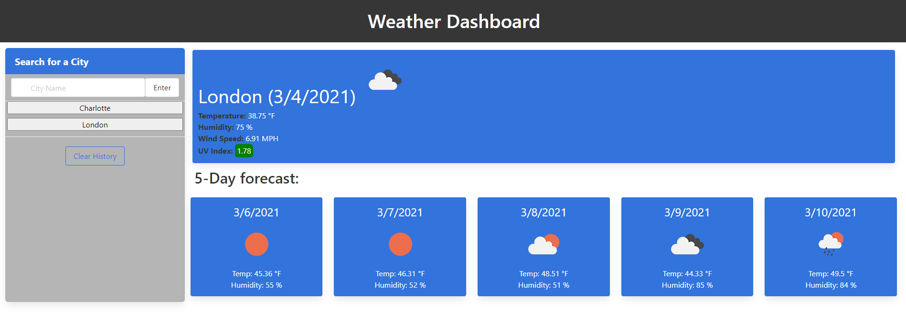

# weather-dashboard

## What
#### Interactive weather dashboard that shows current weather and 5-day forecast for searched city. Searches are stored locally and displayed in a panel on the left side of the screen. When historic searches are pressed, the weather will display again for that city. The site was built with Bulma, JavaScript, and a tiny bit of CSS. 
------
## Why
#### This was a homework assignment for my coding bootcamp with UNC Charlotte. The assignment was meant to strengthen skills with JavaScript, Moment JS, CSS Frameworks, local storage, and server-side API interaction.
------
## How 
#### I started by using components from Bulma's documentation to construct my basic site layout. From there I edited my content and did some minor styling. Then I started working on my JavaScript - fetching from the OpenWeatherMap API, storing searches locally, creating cards for the weather forecast, etc. After my functionality was working to my satisfaction, I did some final styling touches.
------
## Site Link 
### https://naisthorpe.github.io/weather-dashboard/
------
## Site Screenshot
